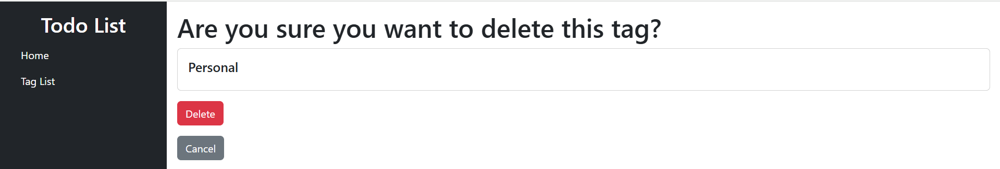
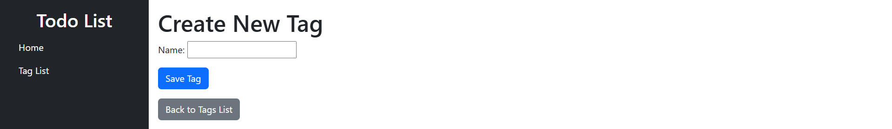

# Todo List 🚀

### A simple and user-friendly web application for managing daily tasks and projects.

## ✅ Key Features:

 📋 View a task list with filtering by status (in progress, completed, overdue).
 📝 Add, edit, and delete tasks.
 ✔️ Mark tasks as completed or move them back to "in progress" status.
 🏷️ Tagging system for organizing tasks.
 🔔 Deadline reminders.
 📅 Calendar for planning and viewing deadlines.


## ⚙️ Loading Initial Data (Optional)
#### To load initial sample data into your database, you can use the following command:
```bash 
python manage.py loaddata tasks_tags_fixture.json
```

## DEMO




